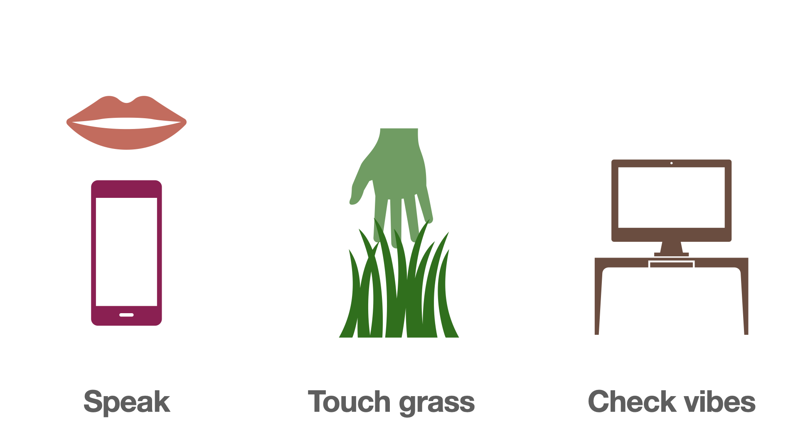

# VibeLine

VibeLine is a powerful voice memo processing system that uses AI to extract meaningful content from your voice recordings. It uses a flexible plugin system to generate various types of content like summaries, blog posts, app ideas, and action items.

The main idea is to let your computer do computer work, while you're out and about touching grass and stuff. Simply speak into the microphone & the vibeline will do the rest. (Or at least most of it.)



> **Note:** VibeLine is a highly opinionated system with specific design choices and workflows. While it offers flexibility through its plugin system, it follows a particular philosophy in how voice memos should be processed and structured. If you're looking for a more generic or customizable solution, this might not be the right tool for you.

## Features

- 🎙️ Automatic voice memo transcription
- 🧹 Transcript cleaning with customizable vocabulary
- 🔌 Flexible plugin system for content extraction
- 🤖 AI-powered content generation using Ollama
- 📝 Built-in plugins for:
  - Summaries
  - Blog posts
  - App ideas
  - Action items/TODOs
- 🎯 Smart plugin matching based on transcript content
- 📁 Organized output directory structure

## UI Project

There's also a separate [UI project](https://github.com/dergigi/vibeline-ui) that provides a web interface for VibeLine. It's built with Next.js and provides a more user-friendly way to interact with your voice memos and generated content.

## Installation

1. Clone the repository:

```bash
git clone https://github.com/yourusername/vibeline.git
cd vibeline
```

1. Make sure you have Python 3.11.2 installed. The project uses `.python-version` to specify the required Python version.

2. Run the setup script:

```bash
./setup.sh
```

This will:

- Create a virtual environment named `vibenv`
- Activate the virtual environment
- Install all required dependencies

## Development Setup

For contributors, we recommend using the development setup script:

```bash
./dev-setup.sh
```

This will:

- Set up the development environment with all linting tools
- Format existing code
- Provide convenient make commands for development
- Optionally install pre-commit hooks (run `make setup-pre-commit` if desired)

### Available Development Commands

- `make help` - Show all available commands
- `make lint` - Run all linting checks (Black, isort, flake8, mypy, markdownlint)
- `make lint-markdown` - Run markdown linting only
- `make format` - Format code with Black and isort
- `make test` - Run tests
- `make check-all` - Run linting and tests

### Version Management

VibeLine uses semantic versioning and maintains a changelog for all releases.

**Available version commands:**

- `make version-patch` - Bump patch version (0.1.0 → 0.1.1)
- `make version-minor` - Bump minor version (0.1.0 → 0.2.0)
- `make version-major` - Bump major version (0.1.0 → 1.0.0)
- `make version-show` - Show version management help
- `make docker-build` - Build Docker image with current version
- `make docker-push` - Push Docker image to registry

**Manual version bumping:**

```bash
python scripts/version.py patch    # For bug fixes
python scripts/version.py minor    # For new features
python scripts/version.py major    # For breaking changes
```

The version script will:

1. Update the version in `pyproject.toml`
2. Update `CHANGELOG.md` with the new version
3. Update `docker-compose.yml` to use the new version
4. Create a git tag for the release
5. Push the tag to the remote repository

**Changelog Guidelines:**

- Use the [Keep a Changelog](https://keepachangelog.com/) format
- Categorize changes as Added, Changed, Fixed, or Removed
- Write clear, concise descriptions
- Include breaking changes prominently

### Code Quality

This project uses several tools to maintain code quality:

- **Black** - Code formatting
- **isort** - Import sorting
- **flake8** - Style and error checking
- **mypy** - Type checking
- **markdownlint-github** - Markdown linting using [GitHub's recommended rules](https://github.com/github/markdownlint-github)
- **pre-commit** - Git hooks for automatic checks (optional)

All PRs must pass linting checks before they can be merged. The GitHub Actions workflow will catch any issues, so pre-commit hooks are optional for local development. See `.github/BRANCH_PROTECTION.md` for details on setting up branch protection rules.

## How to use

### Basic Usage

- Use whatever you want to record voice notes (I use [Fossify](https://github.com/FossifyOrg/Voice-Recorder))
- Use whatever you want to sync your files (I use [Syncthing](https://syncthing.net/))
- Use whatever you want to look at the markdown/output files (I use [Zettel Notes](https://www.zettelnotes.com/))
- Run the `./watch.sh` script on an idle machine to get the most out of it

### Transcript Cleaning

VibeLine includes a transcript cleaning feature that corrects common transcription errors based on customizable vocabulary files. This is especially useful for technical terms, names, or domain-specific jargon that speech recognition models often misinterpret.

#### Base Vocabulary

The project includes a base vocabulary file (`VOCABULARY.txt`) with common corrections that are shared across all users. This file is version controlled and should contain general corrections that apply to most users.

#### Personal Vocabulary

You can create your own personal vocabulary file for corrections specific to your work, names, or domain. This file is stored in your home directory and will not be committed to version control.

**To set up your personal vocabulary:**

1. Create the VibeLine configuration directory:
   ```bash
   mkdir -p ~/.vibeline
   ```

2. Create your personal vocabulary file:
   ```bash
   touch ~/.vibeline/vocabulary.txt
   ```

3. Edit `~/.vibeline/vocabulary.txt` to add your personal corrections:
   ```txt
   # Personal names and terms
   John -> Jon
   Sarah -> Sara
   my company -> Acme Corp
   
   # Technical terms specific to your work
   my framework -> React
   my database -> PostgreSQL
   ```

4. The system will automatically use both vocabulary files, with personal corrections taking precedence.

#### Configuration

You can customize the vocabulary files using environment variables:

- `VOCABULARY_FILE`: Path to the base vocabulary file (default: `VOCABULARY.txt`)
- `PERSONAL_VOCABULARY_FILE`: Path to your personal vocabulary file (default: `~/.vibeline/vocabulary.txt`)

#### Usage

The transcript cleaner will automatically run as part of the extraction process. You can customize the behavior with these options:

- `--no-clean`: Skip the transcript cleaning step entirely

## Contributors

[](https://github.com/dergigi/vibeline/graphs/contributors)

## Contributing

If you make a contribution (always welcome!) please publicly tag [@dergigi](https://njump.me/_@dergigi.com) or one of the maintainers on nostr so that we know something happened here. (GitHub notifications are rekt.)
